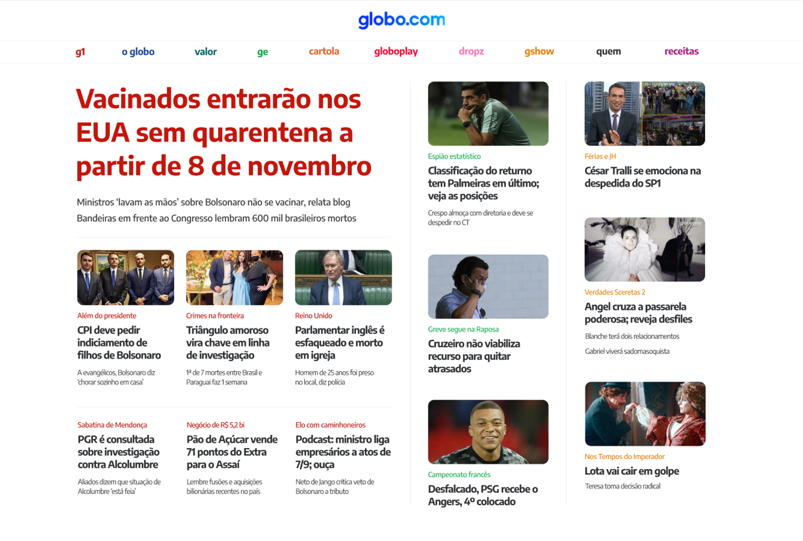

# Globo.com

## Sobre
Criação de um layout mais simplificado da página de notícias globo.com, desenvolvida como atividade da primeira semana de aula do bootcamp da Driven.

- [Figma Web](https://www.figma.com/file/TusiAOJUwrEsBph6gYhUNf/Projeto-Globo.com?node-id=0%3A1)
- [Figma Mobile](https://www.figma.com/file/NlzCsiMaDuGwvyRgaqrcFV/Projeto-Globo.com-B%C3%B4nus-Mobile?node-id=1%3A52)

## 🔗 Acesso
Você pode acessar o site de produção do repositório através do link:

- [globo.com](https://pecorario.github.io/projeto1-globo/)
